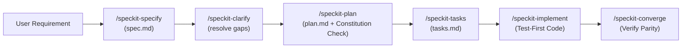

# Developer Onboarding & Getting Started Guide

Welcome to the **FlagManagment** project! 👋

FlagManagment is an open-source, enterprise-grade, self-hosted feature flagging, contextual targeting, and remote configuration platform designed for extreme scale, security, and sub-millisecond local evaluation.

This guide provides everything you need to set up your local environment, understand our architectural philosophy, work with our **Spec-Driven AI Development (SpecKit)** workflow, and contribute high-quality code and tests.

---

## Table of Contents

1. [Project Overview & Tech Stack](#1-project-overview--tech-stack)
2. [Quickstart & Local Environment Setup](#2-quickstart--local-environment-setup)
3. [Repository Structure](#3-repository-structure)
4. [AI & Spec-Driven Development Workflow (SpecKit)](#4-ai--spec-driven-development-workflow-speckit)
5. [Development Standards & Constitution](#5-development-standards--constitution)
6. [Testing & Quality Assurance Guide](#6-testing--quality-assurance-guide)
7. [Documentation Sitemap](#7-documentation-sitemap)
8. [Contribution & Pull Request Guidelines](#8-contribution--pull-request-guidelines)

---

## 1. Project Overview & Tech Stack

FlagManagment provides complete feature parity with modern feature management tools while maintaining open-source self-hosted flexibility.

### Core Stack
- **Backend**: Go 1.24+ (Chi Router for REST, Protobuf & gRPC for high-throughput flag streaming).
- **Database**: PostgreSQL 16 (Raw SQL migrations via `golang-migrate`, deterministic AES-GCM + SHA-256 PII hashing).
- **Cache & Pub/Sub**: Redis 7 (In-memory flag state caching and real-time invalidation events).
- **Frontend Dashboard**: React 19, TypeScript, Vite, TanStack Query, TailwindCSS, Lucide Icons.
- **SDK Ecosystem**: Multi-language SDKs with OpenFeature compliance (`React`, `Node.js`, `Go`, `Python`, `Java`, `.NET`, `iOS`, `Android`).
- **Infrastructure as Code**: Terraform Provider (`providers/terraform`) and Kubernetes Helm Charts (`deploy/helm/flagmanagment`).
- **Observability**: Prometheus metrics (`/metrics`), OpenTelemetry tracing, and Audit Logging with SIEM export.

---

## 2. Quickstart & Local Environment Setup

### Prerequisites
Make sure you have the following installed on your machine:
- [Docker](https://docs.docker.com/get-docker/) & [Docker Compose](https://docs.docker.com/compose/)
- [Go 1.24+](https://golang.org/dl/)
- [Node.js 20+ or 24+](https://nodejs.org/) & `npm`
- [Git](https://git-scm.com/)

---

### Option A: One-Command Docker Setup (Recommended for Full Stack)

To spin up the entire platform (Postgres, Redis, Backend API, Frontend Dashboard):

```bash
# Clone the repository
git clone https://github.com/malah-code/flagmanagment.git
cd flagmanagment

# Start all containers in background
docker compose up -d --build
```

- **Frontend Dashboard**: [http://localhost:3000](http://localhost:3000) (or `http://localhost:5173` in standalone dev mode)
- **Backend API & Health**: [http://localhost:8080/healthz](http://localhost:8080/healthz)
- **gRPC Streaming Server**: `localhost:50051`
- **PostgreSQL**: `localhost:5432` (`flagmgmt` / `flagmgmt_dev`)
- **Redis**: `localhost:6379`

---

### Option B: Local Native Development

For active development, run dependencies via Docker and the services locally:

#### 1. Start Database and Redis:
```bash
docker compose up -d postgres redis
```

#### 2. Start the Backend:
```bash
cd backend
go mod download
go run ./cmd/server
```
The server will automatically execute database migrations from `backend/migrations/` on startup.

#### 3. Start the Frontend:
```bash
cd frontend
npm install
npm run dev
```

---

## 3. Repository Structure

```
FlagManagment/
├── backend/                  # Go core server & business logic
│   ├── cmd/server/           # Application entrypoint (HTTP & gRPC)
│   ├── internal/
│   │   ├── api/              # REST HTTP handlers & middleware
│   │   ├── crypto/           # AES-GCM encryption & SHA-256 PII hashing
│   │   ├── grpc/             # gRPC evaluation & streaming server
│   │   ├── models/           # Domain entity definitions
│   │   ├── repository/       # PostgreSQL data access layer
│   │   └── services/         # Business services (targeting, rollout, audit)
│   ├── migrations/           # SQL migration files (.up.sql / .down.sql)
│   └── tests/                # Backend unit & integration test suites
│
├── frontend/                 # React 19 + Vite dashboard
│   ├── src/
│   │   ├── components/       # UI components (targeting builder, payloads, modals)
│   │   ├── hooks/            # TanStack Query custom hooks
│   │   ├── pages/            # View pages (Flags, Environments, Integrations, SSO)
│   │   └── services/         # REST API client & Axios wrappers
│   └── package.json
│
├── sdk/                      # Client and Server SDKs
│   ├── go/                   # Go SDK & OpenFeature provider
│   ├── node/                 # Node.js TypeScript SDK
│   ├── python/               # Python SDK
│   ├── react/                # React Hooks & context provider
│   └── ...                   # Android, iOS, Java, .NET
│
├── providers/
│   └── terraform/            # Official Terraform Provider for FlagManagment
│
├── specs/                    # Spec-Driven Development (001 to 039 feature specs)
├── docs/                     # Architecture, PRD, Constitution, & Test Plans
├── deploy/helm/              # Production Kubernetes Helm Charts
└── e2e/                      # Playwright End-to-End test suites
```

---

## 4. AI & Spec-Driven Development Workflow (SpecKit)

We follow a strict **Spec-Driven Development (SDD)** paradigm paired with AI agents and **SpecKit**. 

No code is written without a formal, approved specification and strict architectural alignment.



### SpecKit Lifecycle Stages

| Step | Command / Skill | Purpose & Output |
|---|---|---|
| **1. Specify** | `/speckit-specify` | Creates a new feature branch and generates `specs/NNN-feature/spec.md` with prioritized user stories, independent acceptance tests, and edge cases. |
| **2. Clarify** | `/speckit-clarify` | Asks up to 5 targeted clarification questions to resolve ambiguous requirements before implementation. |
| **3. Plan** | `/speckit-plan` | Produces `specs/NNN-feature/plan.md`, `data-model.md`, `research.md`, and performs a mandatory Constitution Compliance Check. |
| **4. Tasks** | `/speckit-tasks` | Breaks the plan into ordered, actionable, dependency-linked items in `specs/NNN-feature/tasks.md`. |
| **5. Implement** | `/speckit-implement` | Executes implementation tasks adhering to the **Test-First (TDD)** approach. |
| **6. Converge** | `/speckit-converge` | Audits the codebase against the spec to ensure zero unbuilt gaps or missing acceptance scenarios. |

---

## 5. Development Standards & Constitution

All contributions MUST abide by the **8 Constitutional Principles** defined in [constitution-details.md](file:///home/tarikelmallah/Projects/FlagManagment/docs/constitution-details.md) and `.specify/memory/constitution.md`:

1. **Principle I: API-First Contract Design**: Formal OpenAPI 3.0 / Protobuf contracts must precede business logic.
2. **Principle II: Environment Isolation**: Strict cryptographic isolation between environments (Dev, QA, Staging, Prod).
3. **Principle III: Governance by Default**: Immutable audit logging, RBAC, and approval workflows are first-class citizens.
4. **Principle IV: Local Evaluation Performance (NON-NEGOTIABLE)**: Server-side SDK evaluation must complete in **< 1ms** with zero network roundtrips per flag evaluation.
5. **Principle V: Test-First Quality Gates**: Unit, integration, and E2E tests must be written and passing before PR approval.
6. **Principle VI: OpenFeature Interoperability**: SDKs must strictly adhere to the [OpenFeature Specification](https://openfeature.dev/).
7. **Principle VII: PII Protection & Privacy Compliance**: PII fields (emails, identities) must be encrypted at rest (AES-GCM) and scrubbed in audit logs.
8. **Principle VIII: Cloud-Native Portability**: Zero proprietary cloud lock-in. Compatible with standard Docker, Kubernetes, and Helm.

---

## 6. Testing & Quality Assurance Guide

We maintain 100% test coverage expectations across backend, frontend, SDKs, and E2E workflows.

### 1. Backend Testing
```bash
cd backend

# Run all unit and integration tests
go test -v ./...

# Run tests with race condition detection and coverage report
go test -race -coverprofile=coverage.out ./...
go tool cover -func=coverage.out
```

### 2. Backend Linting & Formatting
```bash
cd backend
go vet ./...
golangci-lint run ./...
```

### 3. Frontend Unit & Component Testing
```bash
cd frontend

# Run Vitest test suites
npx vitest run

# Run in watch mode during development
npx vitest
```

### 4. Frontend Linting & Style Checks
```bash
cd frontend

# ESLint check
npx eslint src/

# Prettier format check
npx prettier --check "src/**/*.{ts,tsx,css}"

# Automatically fix code formatting
npx prettier --write "src/**/*.{ts,tsx,css}"
```

### 5. End-to-End (E2E) Browser Testing with Playwright
```bash
cd e2e
npm install
npx playwright install --with-deps

# Run end-to-end tests against the running stack
npx playwright test
```

### 6. Comprehensive Test Plan Matrix
For a complete list of all **158 canonical test cases** covering every feature layer, refer to:
- [TEST_PLAN.md](file:///home/tarikelmallah/Projects/FlagManagment/docs/TEST_PLAN.md) — Index and execution guidance.
- [TEST_EXECUTION_TRACKER.md](file:///home/tarikelmallah/Projects/FlagManagment/docs/TEST_EXECUTION_TRACKER.md) — Real-time test execution and pass/fail tracker.
- [`/specs/038-comprehensive-test-plan/spec.md`](../specs/038-comprehensive-test-plan/spec.md) — Detailed Given/When/Then test specifications.

---

## 7. Documentation Sitemap

| Document | Purpose |
|---|---|
| [g-requirements.md](file:///home/tarikelmallah/Projects/FlagManagment/docs/g-requirements.md) | Comprehensive Product Requirements Document (PRD). |
| [p-requirements.md](file:///home/tarikelmallah/Projects/FlagManagment/docs/p-requirements.md) | Product and Technical Requirements Specification. |
| [constitution-details.md](file:///home/tarikelmallah/Projects/FlagManagment/docs/constitution-details.md) | Detailed explanation of the 8 constitutional principles. |
| [PLAN.md](file:///home/tarikelmallah/Projects/FlagManagment/docs/PLAN.md) | Master development milestones, gap analysis, and phase roadmap. |
| [TEST_PLAN.md](file:///home/tarikelmallah/Projects/FlagManagment/docs/TEST_PLAN.md) | 158-point test plan index across all functional areas. |
| [TEST_EXECUTION_TRACKER.md](file:///home/tarikelmallah/Projects/FlagManagment/docs/TEST_EXECUTION_TRACKER.md) | Quality assurance execution checklist and validation logs. |

---

## 8. Contribution & Pull Request Guidelines

1. **Create a Feature Branch**:
   ```bash
   git checkout -b feature/040-your-feature-name
   ```
2. **Follow Spec-Driven Development**:
   - If adding a significant capability, create or reference the corresponding spec in `specs/`.
3. **Ensure All Quality Gates Pass**:
   - `cd backend && go vet ./... && go test ./...`
   - `cd frontend && npx eslint src/ && npx prettier --check "src/**/*.{ts,tsx,css}" && npx vitest run`
   - Docker builds succeed (`docker compose build`).
4. **Commit Format**:
   - Follow Conventional Commits: `feat:`, `fix:`, `refactor:`, `test:`, `docs:`.
5. **Open a Pull Request**:
   - Link the PR to the relevant specification or issue.
   - Ensure the CI build on GitHub Actions is green.

Happy hacking, and welcome to the FlagManagment engineering team! 🚀
