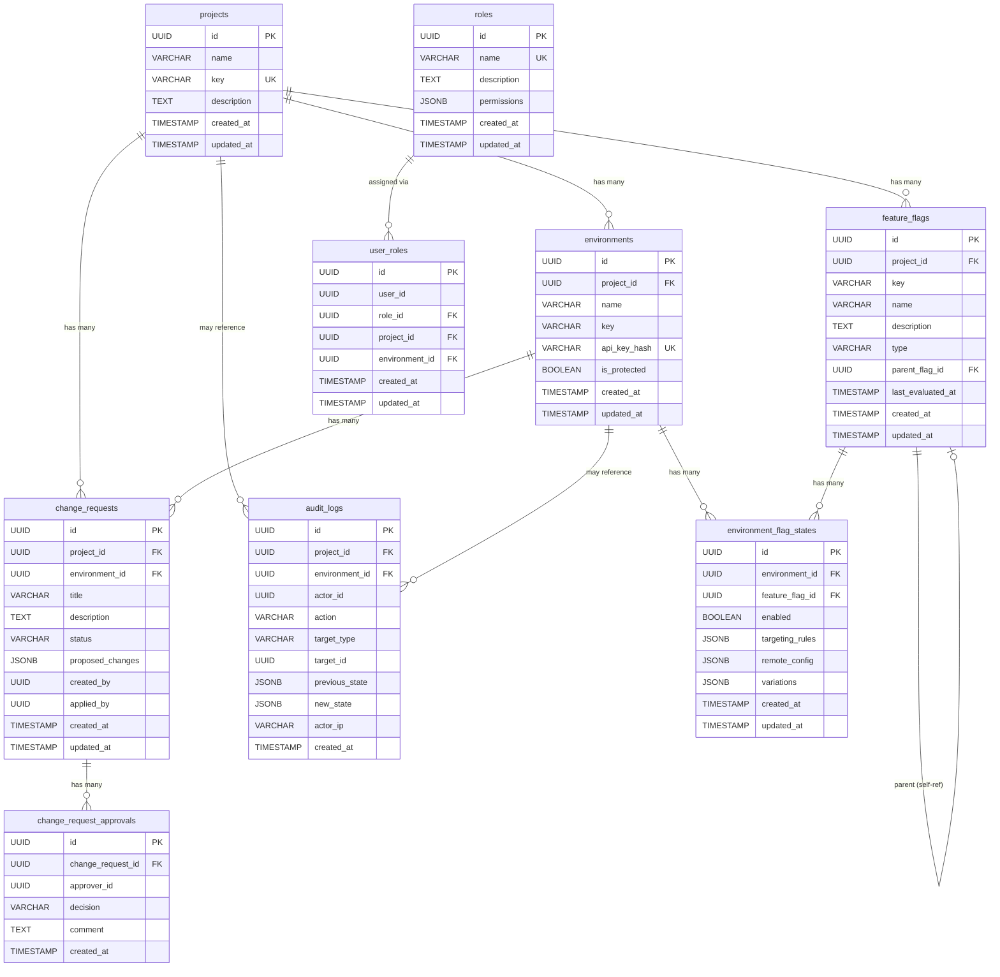

# Data Model: Data Model & State Management

**Feature**: 002-data-model-state
**Date**: 2026-07-20

---

## Entity Relationship Diagram

---

## Entity Details

### 1. projects

Top-level organizational container for feature flags and environments.

| Column | Type | Constraints | Notes |
|--------|------|-------------|-------|
| `id` | `UUID` | `PRIMARY KEY`, `DEFAULT gen_random_uuid()` | |
| `name` | `VARCHAR(255)` | `NOT NULL` | Display name |
| `key` | `VARCHAR(100)` | `NOT NULL`, `UNIQUE` | URL-safe slug (`my-project`) |
| `description` | `TEXT` | | Optional long description |
| `created_at` | `TIMESTAMPTZ` | `NOT NULL`, `DEFAULT NOW()` | |
| `updated_at` | `TIMESTAMPTZ` | `NOT NULL`, `DEFAULT NOW()` | Updated via trigger or app |

**Validation Rules**:
- `key` must be lowercase alphanumeric with hyphens, 3–100 characters.
- `name` must be 1–255 characters.

---

### 2. environments

Deployment target within a project (e.g., Dev, QA, Staging, Production).

| Column | Type | Constraints | Notes |
|--------|------|-------------|-------|
| `id` | `UUID` | `PRIMARY KEY`, `DEFAULT gen_random_uuid()` | |
| `project_id` | `UUID` | `NOT NULL`, `REFERENCES projects(id) ON DELETE CASCADE` | |
| `name` | `VARCHAR(255)` | `NOT NULL` | Display name |
| `key` | `VARCHAR(100)` | `NOT NULL` | URL-safe slug |
| `api_key_hash` | `VARCHAR(64)` | `NOT NULL`, `UNIQUE` | SHA-256 hex digest |
| `is_protected` | `BOOLEAN` | `NOT NULL`, `DEFAULT FALSE` | Requires change requests |
| `created_at` | `TIMESTAMPTZ` | `NOT NULL`, `DEFAULT NOW()` | |
| `updated_at` | `TIMESTAMPTZ` | `NOT NULL`, `DEFAULT NOW()` | |

**Constraints**:
- `UNIQUE(project_id, key)` — environment key must be unique per project.

---

### 3. feature_flags

Feature flag definition scoped to a project.

| Column | Type | Constraints | Notes |
|--------|------|-------------|-------|
| `id` | `UUID` | `PRIMARY KEY`, `DEFAULT gen_random_uuid()` | |
| `project_id` | `UUID` | `NOT NULL`, `REFERENCES projects(id) ON DELETE CASCADE` | |
| `key` | `VARCHAR(255)` | `NOT NULL` | Flag identifier (`enable-dark-mode`) |
| `name` | `VARCHAR(255)` | `NOT NULL` | Display name |
| `description` | `TEXT` | | |
| `type` | `VARCHAR(20)` | `NOT NULL`, `CHECK (type IN ('BOOLEAN', 'MULTIVARIATE', 'JSON'))` | Flag evaluation type |
| `parent_flag_id` | `UUID` | `REFERENCES feature_flags(id) ON DELETE SET NULL` | Self-referencing FK for dependencies |
| `last_evaluated_at` | `TIMESTAMPTZ` | | NULL until first SDK evaluation |
| `created_at` | `TIMESTAMPTZ` | `NOT NULL`, `DEFAULT NOW()` | |
| `updated_at` | `TIMESTAMPTZ` | `NOT NULL`, `DEFAULT NOW()` | |

**Constraints**:
- `UNIQUE(project_id, key)` — flag key must be unique per project.
- `CHECK (parent_flag_id != id)` — prevent direct self-reference.

---

### 4. environment_flag_states

Junction table holding per-environment configuration for each flag.

| Column | Type | Constraints | Notes |
|--------|------|-------------|-------|
| `id` | `UUID` | `PRIMARY KEY`, `DEFAULT gen_random_uuid()` | |
| `environment_id` | `UUID` | `NOT NULL`, `REFERENCES environments(id) ON DELETE CASCADE` | |
| `feature_flag_id` | `UUID` | `NOT NULL`, `REFERENCES feature_flags(id) ON DELETE CASCADE` | |
| `enabled` | `BOOLEAN` | `NOT NULL`, `DEFAULT FALSE` | Master on/off toggle |
| `targeting_rules` | `JSONB` | `DEFAULT '{}'::jsonb` | See research.md §3 |
| `remote_config` | `JSONB` | `DEFAULT '{}'::jsonb` | See research.md §4 |
| `variations` | `JSONB` | | Multivariate variation definitions |
| `created_at` | `TIMESTAMPTZ` | `NOT NULL`, `DEFAULT NOW()` | |
| `updated_at` | `TIMESTAMPTZ` | `NOT NULL`, `DEFAULT NOW()` | |

**Constraints**:
- `UNIQUE(environment_id, feature_flag_id)` — one state per flag per environment.

---

### 5. change_requests

Proposed mutations for protected environments requiring approval workflow.

| Column | Type | Constraints | Notes |
|--------|------|-------------|-------|
| `id` | `UUID` | `PRIMARY KEY`, `DEFAULT gen_random_uuid()` | |
| `project_id` | `UUID` | `NOT NULL`, `REFERENCES projects(id) ON DELETE CASCADE` | |
| `environment_id` | `UUID` | `NOT NULL`, `REFERENCES environments(id) ON DELETE CASCADE` | |
| `title` | `VARCHAR(255)` | `NOT NULL` | |
| `description` | `TEXT` | | |
| `status` | `VARCHAR(20)` | `NOT NULL`, `DEFAULT 'PENDING'`, `CHECK (status IN ('PENDING', 'APPROVED', 'REJECTED', 'APPLIED'))` | State machine |
| `proposed_changes` | `JSONB` | `NOT NULL` | Diff of current vs proposed state |
| `created_by` | `UUID` | `NOT NULL` | Actor who initiated |
| `applied_by` | `UUID` | | Actor who applied (after approval) |
| `created_at` | `TIMESTAMPTZ` | `NOT NULL`, `DEFAULT NOW()` | |
| `updated_at` | `TIMESTAMPTZ` | `NOT NULL`, `DEFAULT NOW()` | |

**State Transitions**: `PENDING → APPROVED → APPLIED` or `PENDING → REJECTED`.

---

### 6. change_request_approvals

Individual approval/rejection decisions on a change request.

| Column | Type | Constraints | Notes |
|--------|------|-------------|-------|
| `id` | `UUID` | `PRIMARY KEY`, `DEFAULT gen_random_uuid()` | |
| `change_request_id` | `UUID` | `NOT NULL`, `REFERENCES change_requests(id) ON DELETE CASCADE` | |
| `approver_id` | `UUID` | `NOT NULL` | |
| `decision` | `VARCHAR(10)` | `NOT NULL`, `CHECK (decision IN ('APPROVE', 'REJECT'))` | |
| `comment` | `TEXT` | | |
| `created_at` | `TIMESTAMPTZ` | `NOT NULL`, `DEFAULT NOW()` | |

---

### 7. audit_logs

Immutable, append-only record of all administrative actions.

| Column | Type | Constraints | Notes |
|--------|------|-------------|-------|
| `id` | `UUID` | `PRIMARY KEY`, `DEFAULT gen_random_uuid()` | |
| `project_id` | `UUID` | `REFERENCES projects(id) ON DELETE SET NULL` | Nullable for global events |
| `environment_id` | `UUID` | `REFERENCES environments(id) ON DELETE SET NULL` | Nullable |
| `actor_id` | `UUID` | `NOT NULL` | |
| `action` | `VARCHAR(100)` | `NOT NULL` | e.g., `flag.created`, `env.protected` |
| `target_type` | `VARCHAR(50)` | `NOT NULL` | e.g., `feature_flag`, `environment` |
| `target_id` | `UUID` | `NOT NULL` | |
| `previous_state` | `JSONB` | | Snapshot before change |
| `new_state` | `JSONB` | | Snapshot after change |
| `actor_ip` | `VARCHAR(45)` | | IPv4 or IPv6 |
| `created_at` | `TIMESTAMPTZ` | `NOT NULL`, `DEFAULT NOW()` | |

**Immutability**: No `updated_at` column. Application layer must enforce no UPDATE or DELETE.

---

### 8. roles

Named permission sets for RBAC.

| Column | Type | Constraints | Notes |
|--------|------|-------------|-------|
| `id` | `UUID` | `PRIMARY KEY`, `DEFAULT gen_random_uuid()` | |
| `name` | `VARCHAR(100)` | `NOT NULL`, `UNIQUE` | e.g., `system_admin`, `project_owner` |
| `description` | `TEXT` | | |
| `permissions` | `JSONB` | `NOT NULL`, `DEFAULT '[]'::jsonb` | Array of permission strings |
| `created_at` | `TIMESTAMPTZ` | `NOT NULL`, `DEFAULT NOW()` | |
| `updated_at` | `TIMESTAMPTZ` | `NOT NULL`, `DEFAULT NOW()` | |

**Seed Roles**: `system_admin`, `project_owner`, `release_manager`, `qa_engineer`, `read_only_auditor`.

---

### 9. user_roles

Maps users to roles with optional project/environment scope.

| Column | Type | Constraints | Notes |
|--------|------|-------------|-------|
| `id` | `UUID` | `PRIMARY KEY`, `DEFAULT gen_random_uuid()` | |
| `user_id` | `UUID` | `NOT NULL` | External identity provider UUID |
| `role_id` | `UUID` | `NOT NULL`, `REFERENCES roles(id) ON DELETE CASCADE` | |
| `project_id` | `UUID` | `REFERENCES projects(id) ON DELETE CASCADE` | NULL = global scope |
| `environment_id` | `UUID` | `REFERENCES environments(id) ON DELETE CASCADE` | NULL = project-wide scope |
| `created_at` | `TIMESTAMPTZ` | `NOT NULL`, `DEFAULT NOW()` | |
| `updated_at` | `TIMESTAMPTZ` | `NOT NULL`, `DEFAULT NOW()` | |

**Constraints**:
- `UNIQUE(user_id, role_id, project_id, environment_id)` — prevent duplicate assignments.
